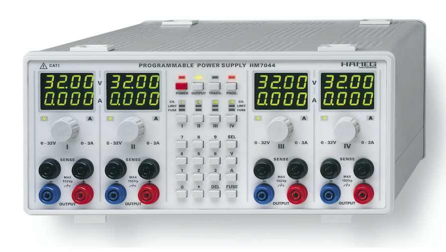

```
(under construction)
```




# Repair of a Hameg HM7044 Power Supply

I was lucky enough to get a Hameg HM7044 384W Power Supply practically for free. It got sorted out, because the current meter display is supposedly defect.

This page and repository serves as documentation for the steps in the repair process.

## Error diagnostics and description

The Current meter does only show 0s on every channel in normal state.

Basic tests on all outputs suggested other functionality is still in order. For setting the current limit as well as when current limit is reached, values are correctly displayed in the current meter. 

In another test remote functionality via RS-232 was confirmed succesfully.


- current meter only reads 0s in normal use state
- current limit value is displayed correctly
- other functionality seems to be ok


## IC Identification

- **LM317L** 3-Terminal Adjustable Regulator
([datasheet](https://www.ti.com/lit/ds/symlink/lm317l.pdf?ts=1596796656076&ref_url=https%253A%252F%252Fwww.google.com%252F))

- **LM337LM** 3-Terminal Adjustable Regulator
([datasheet](https://www.ti.com/lit/ds/symlink/lm337l.pdf?ts=1596795119863&ref_url=https%253A%252F%252Fwww.google.com%252F))


- **LTC1446** Dual 12-Bit Rail-to-Rail Micropower DAC ([datasheet](https://www.analog.com/media/en/technical-documentation/data-sheets/1446fa.pdf)) 

- **MCP3202** 2.7V Dual Channel 12-Bit A/D Converter
with SPI Serial Interface ([datasheet](https://asset.conrad.com/media10/add/160267/c1/-/en/001083119DS01/datenblatt-1083119-microchip-technology-mcp3202-bisn-datenerfassungs-ic-analog-digital-wandler-adc-extern-soic-8-n.pdf))

- **MC33172** Low power dual bipolar operational amplifiers ([datasheet](https://www.st.com/resource/en/datasheet/mc33172.pdf))


- **KW1-391AGA** Single Digit 7-segment LED Display ([datasheet](https://www.luckylight.cn/media/component/data-sheet/KW1-391AGA.pdf))

- **ICM7228** 8-Digit, Microprocessor-Compatible, LED Display Decoder Driver ([datasheet](https://www.renesas.com/cn/en/www/doc/datasheet/icm7228.pdf))

- **HCT4094** 8-stage shift-and-store bus register ([datasheet](https://assets.nexperia.com/documents/data-sheet/74HC_HCT4094.pdf))

- **HCT164** 8-bit serial-in, parallel-out shift register ([datasheet](https://assets.nexperia.com/documents/data-sheet/74HC_HCT164.pdf))

- **HCT165** High-Speed CMOS Logic 8-Bit Parallel-In/Serial-Out Shift Register ([datasheet](https://www.ti.com/lit/ds/schs156c/schs156c.pdf?ts=1596879013114&ref_url=https%253A%252F%252Fwww.google.com%252F))

- **TLP2630** Photocoupler (photo-IC output) ([datasheet](https://toshiba.semicon-storage.com/eu/semiconductor/product/optoelectronics/detail.TLP2630.html))


### Notes

**Fault details:**
- current meter shows 0.0 A during normal state
- current meter shows current limit value during setup and when in limiting state

-> There must be a switch for switching between saved limit value and momentary sense reading value!

- Must be on CPU board, since LED Digits input signal comes from B2B-connector

data input Serial/Parallel conv <-> Pin 17 front board to cpu board connector <-> Pin 2 4094 shift register & Pin 27 of main asic / CPU

-> CPU sends serial signal to both shift register for optocoupler drive, as well as Serial/Parallel conv for driving meter displays

TLP2630 output pins to Pin 16/18 of B2B connector, pulled high via 10k resistors to VCC (of secondary/supply board side), Pin 8 of B2B Connector


___
Next:

- optocoupler going where exactly? (switch between limit and sensed current value?)
- optocoupler defect? input/control signal working? (4094?)


___


**Display drivers 7228:**
- Shutdown Pin (10) shorted to VDD -> all drivers always on


**Block Diagram**
- separate Drivers for Current Meter (bottom row LED digits KW1-391AGA) and Voltage Meter (top row LED digits KW1-391AGA)

for current meter:

KW1-391AGA <-> 7228 <-> HCT164 <-> Connector Pin 17


## Pictures

### Front PCB

<div>
<p>
<figure style="float:left; width:45%">
<a href="https://github.com/BorisJung/HM7044/blob/master/Pics/front_top.jpg?raw=true" target="_blank">
</a><br>
<figcaption style="text-align:left">Front PCB of HM7044 top side</figcaption>
</figure>

<figure style="width:45%">
<a href="https://github.com/BorisJung/HM7044/blob/master/Pics/front_bottom.jpg?raw=true" target="_blank">
</a><br>
<figcaption style="text-align:left">Front PCB of HM7044 bottom side</figcaption>
</figure>
</p>
</div>

<br>


___

### Main PCB

<div>
<p>
<figure style="float:left; width:44%">
<a href="https://github.com/BorisJung/HM7044/blob/master/Pics/top.jpg?raw=true" target="_blank">
</a><br>
<figcaption style="text-align:left">Main PCB of HM7044 top side</figcaption>
</figure>

<figure style="width:44%">
<a href="https://github.com/BorisJung/HM7044/blob/master/Pics/bottom.jpg?raw=true" target="_blank">
</a><br>
<figcaption style="text-align:left">Main PCB of HM7044 bottom side</figcaption>
</figure>
</p>
</div>

<br>


